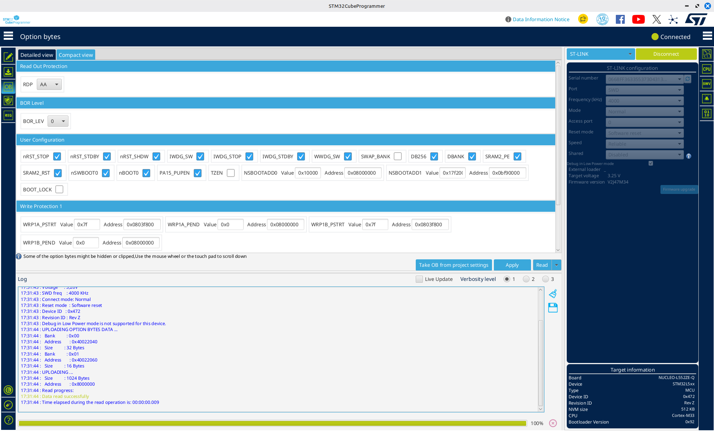
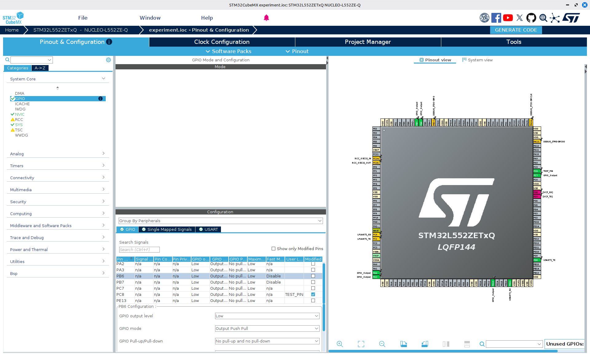
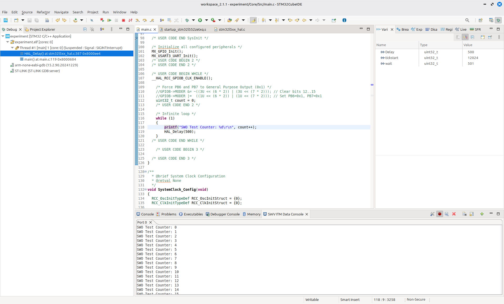

# Lab Notes: Configuring Signal Outputs and Header Intricacies on Nucleo-L552ZE-Q

## Objective
To interpret raw digital signals into a human-readable format, I set out to identify pins on the NUCLEO-L552ZE-Q capable of transmitting data (`GPIO_Output` / `USART_TX`) and verify them using a logic analyser and PulseView.

---

## Note on code files:
The main code is in C programming language files in a standard function called "main".
Each file is independent of other C files.
The projects were created in STM32CubeMX as projects without TrustZone(to configure the pins), then opened in STM32CubeIDE(to transmit data or toggle the pins).

---

## Initial Setup & Preliminary Failures

1. **Breadboard Interface:** Connected the Nucleo board to a logic analyzer via a breadboard using DuPont jumpers, referencing a common ground header.
2. **Firmware Environment:** Created a dual-subproject setup in STM32CubeIDE with **TrustZone enabled** (Secure and Non-Secure subprojects), given the MCU's native hardware support. Pins were configured to toggle directly in code.
3. **Observation:** PulseView captured **no signal activity** across any channel.
4. **Isolation Step:** Bypassed the breadboard and wired the logic analyzer directly to the front-facing female headers (testing `A0`, `A1`, `TX`, etc.). Still no signal output detected in PulseView.

---

## Header Investigation & Hardware Hypotheses

### Hypothesis 1: Signal attenuation or routing issues with female headers
Shifted testing to the male Morpho headers (`CN11` / `CN12`) on the back of the board, using a verified common ground and testing various pins (such as `PB0`).
* **Result:** Still no signal detected on the analyzer.

### Hypothesis 2: Incorrect peripheral mode configuration
In STM32CubeMX, reconfigured the target pins to `GPIO_Output` and `USART_TX` (asynchronous mode). Compiled and ran the code across both Secure and Non-Secure subprojects.
* **Result:** Pins remained unresponsive.

### Hypothesis 3: TrustZone memory isolation / peripheral access rights
Suspected that active TrustZone defaults were blocking peripheral bus writes or restricting access to the GPIO port registers (`MODER`, `ODR`).

---

## Systematic Root-Cause Analysis & Diagnostics

### 1. Hardware Sanity Check (Built-in LEDs & Multi-Function Pins)
To verify basic board execution, I tested the onboard user LEDs:
* **`LD1` (Green) & `LD2` (Blue):** Functioned as expected.
* **`LD3` (Red / `PA9`):** Failed to blink. Per the Nucleo datasheet, `PA9` features heavy alternate-function multiplexing (`SAI1_FS_A` / `TIM15_BKIN` / `USART1_TX`). Signal routing conflicts on this trace prevent simple output toggling unless specifically configured.

### 2. Deep Dive into Hardware Solder Bridges (SBs) & Pin Isolation
Detailed investigation of specific pins revealed several physical PCB and multiplexing constraints:

* **`A0` (Female Header):** Verified **WORKING** with common ground.
* **`PB0` (Failure):** Solder bridge **`SB162` is OPEN (OFF) by default**. When `SB162` is open, the physical metal trace between the STM32 silicon pad and header sockets (`CN11` / `CN9`) is physically severed on the PCB. The MCU toggles the internal pad, but the signal cannot reach the analyzer probe. Additionally, `PB0` defaults to `OCTOSPI_IO1` peripheral mode.
* **`PB3` (SWO Trace):** Showed no standard voltage toggle because **`SB140` is closed (ON)**. This routes `PB3` as `SWO_MCU` directly to the onboard ST-LINK for SWO trace debugging via USB, isolating it from standard pin output.
* **`PB6`:** **WORKING**, subject to specific board power and line state conditions.
* **`PB7`:** Unresponsive (line held flat LOW).

---

## TrustZone & Option Byte Verification (STM32CubeProgrammer)

To eliminate software environment ambiguity, I connected the board to **STM32CubeProgrammer** to inspect the target's Option Bytes:
* **`TZEN` (TrustZone Enable):** `0` (TrustZone is **disabled** by default in hardware).
* **`RDP` (Readout Protection):** `0xAA` (Level 0 - Flash fully open, no read protection).

> **Key Takeaway:** The dual Secure/Non-Secure project structure was adding unnecessary abstraction layers for hardware testing because hardware TrustZone was disabled at the silicon level.

---

## Verification Without TrustZone

Created a clean, single-application project in STM32CubeMX without TrustZone enabled:
1. Configured candidate pins explicitly as `GPIO_Output` / `USART`.
2. Measured physical voltage transitions using a digital multimeter as a secondary check.
3. **Confirmed Active/Working Pins:** `PA2`, `PA3`, `PA7`, `PB3` (via SWO), `PB6`, 'PB7, `PC7`, `PC8`, `PE13`, `A0` (`PA3`), and some other.
4. **`PC7` Behavior:** Provided clear voltage transitions. `PC7` defaults to driving the onboard LED path (`SB120` OFF, `SB118` ON default configuration). A 3.3V logic level averaged ~1.9V under rapid toggle on the meter.

---

## Direct Register Analysis (`MODER`)

To bypass HAL abstraction and rule out permission blocks => use direct register writes to the GPIO Mode Register (`GPIOx_MODER`) at runtime via code(for e.g. for PB6, PC7 pin):
* Making pin mode bits directly (e.g., transitioning from `0x3` [Analog/Reset] to `0x1` [General Purpose Output]).
* Verified register bit changes in the IDE Special Function Registers (SFR) view.

> **Conclusion:** For pins where `MODER` updated correctly to output mode (`0x1`) in memory but still failed to drive a physical signal at the header socket, the root cause was isolated to **open solder bridges (PCB airgaps)** or **hardwired peripheral multiplexing conflicts**.

---

## Internal Output Implementation
SWV Trace - Tracing Pins Output Internally (in STM32CubeIDE)
For example in this way can be tracef the outout of PA2 pin which is connected to the debugger.

---

## Summary of Working Pins & Key Takeaways

| Pin / Label | Peripheral Function | Hardware Status | Notes |
| :--- | :--- | :--- | :--- |
| **`A0` (`PA3`)** | `GPIO_Output` | ✅ **Working** | Direct trace to female header |
| **`PA7`** | `GPIO_Output` | ✅ **Working** | Verified via multimeter & logic analyzer |
| **`PB6`** | `GPIO_Output` | ✅ **Working** | Subject to line state conditions |
| **`PC7`** | `GPIO_Output` / `LED` | ✅ **Working** | Connected to `LD2` path via `SB118` |
| **`PB0`** | `OCTOSPI_IO1` / `GPIO` | ❌ **Disconnected** | `SB162` OFF by default (Trace severed) |
| **`PB3`** | `SWO_MCU` | ⚠️ **Special Case** | `SB140` ON; routed to ST-LINK SWO trace |
| **`PA9`** | `GPIO_Output` | ❌ **Disconnected** | Signal routing conflict, multiplexity problem(SAI1_FS_A, TIM15_BKIN, and USART1_TX) |
| **`PB0`** | `OCTOSPI_I01` | ❌ **Disconnected** | `SB162` OFF; no resistor, pad and header socket are disconnected, MCU toggles internally, but the signal never reaches the pin |
| **`PD8`** | `USART3_TX` | ❌ **Disconnected** | `SB123` is OFF, SB124 is ON; PD8 is hardwired to the ST-LINK Virtual COM Port (VCP) USB interface by default, disconnecting it from the Arduino female header pin D1 (USART_A_TX).|
| **`PC0`** | `GPIO_Output` | ❌ **Disconnected** | On many Nucleo designs, PC0 connects to an analog filtering capacitor (100nF) on the board to stabilize it for ADC measurements. High-speed 2ms digital pulses get smoothed out or filtered out completely by the onboard passive components before reaching the header pin. |

